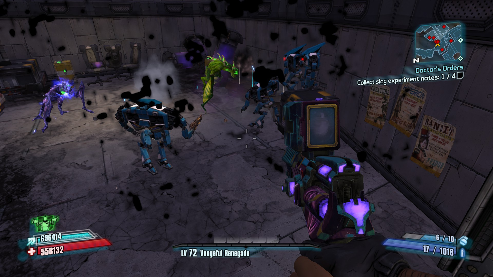

# Find the correct Population"pool"

For this example I'm at ***Wildlife Exploitation Preserve***.

Use:

```
getall WillowPopulationDefinition Name
```

to get an overview of the "pools", basically the same procedure as in the Lootpool guide.
That's why this won't be as extended as the other guide.

For this example I'm interested in the Spawnrate of the various LootMidgets, especially Jimmy Jenkins.

So I'll use:

```
obj dump PopDef_LootMidget_HyperionMix
```

The result will be

```
ActorArchetypeList(0)=(SpawnFactory=PopulationFactoryBalancedAIPawn'GD_Population_Midget.Population.LootMidget.PopDef_LootMidget_HyperionMix:PopulationFactoryBalancedAIPawn_4',Probability=(BaseValueConstant=1.000000,BaseValueAttribute=None,InitializationDefinition=None,BaseValueScaleConstant=1.000000),MaxActiveAtOneTime=(BaseValueConstant=0.000000,BaseValueAttribute=None,InitializationDefinition=None,BaseValueScaleConstant=0.000000),TestVisibility=False,TestFOV=False)

ActorArchetypeList(1)=(SpawnFactory=PopulationFactoryBalancedAIPawn'GD_Population_Midget.Population.LootMidget.PopDef_LootMidget_HyperionMix:PopulationFactoryBalancedAIPawn_3',Probability=(BaseValueConstant=1.000000,BaseValueAttribute=None,InitializationDefinition=None,BaseValueScaleConstant=1.000000),MaxActiveAtOneTime=(BaseValueConstant=0.000000,BaseValueAttribute=None,InitializationDefinition=None,BaseValueScaleConstant=0.000000),TestVisibility=False,TestFOV=False)

ActorArchetypeList(2)=(SpawnFactory=PopulationFactoryBalancedAIPawn'GD_Population_Midget.Population.LootMidget.PopDef_LootMidget_HyperionMix:PopulationFactoryBalancedAIPawn_2',Probability=(BaseValueConstant=1.000000,BaseValueAttribute=None,InitializationDefinition=None,BaseValueScaleConstant=1.000000),MaxActiveAtOneTime=(BaseValueConstant=0.000000,BaseValueAttribute=None,InitializationDefinition=None,BaseValueScaleConstant=0.000000),TestVisibility=False,TestFOV=False)

ActorArchetypeList(3)=(SpawnFactory=PopulationFactoryBalancedAIPawn'GD_Population_Midget.Population.LootMidget.PopDef_LootMidget_HyperionMix:PopulationFactoryBalancedAIPawn_1',Probability=(BaseValueConstant=1.000000,BaseValueAttribute=None,InitializationDefinition=None,BaseValueScaleConstant=1.000000),MaxActiveAtOneTime=(BaseValueConstant=0.000000,BaseValueAttribute=None,InitializationDefinition=None,BaseValueScaleConstant=0.000000),TestVisibility=False,TestFOV=False)

ActorArchetypeList(4)=(SpawnFactory=PopulationFactoryBalancedAIPawn'GD_Population_Midget.Population.LootMidget.PopDef_LootMidget_HyperionMix:PopulationFactoryBalancedAIPawn_0',Probability=(BaseValueConstant=1.000000,BaseValueAttribute=None,InitializationDefinition=None,BaseValueScaleConstant=1.000000),MaxActiveAtOneTime=(BaseValueConstant=0.000000,BaseValueAttribute=None,InitializationDefinition=None,BaseValueScaleConstant=0.000000),TestVisibility=False,TestFOV=False)

ActorArchetypeList(5)=(SpawnFactory=PopulationFactoryBalancedAIPawn'GD_Population_Midget.Population.LootMidget.PopDef_LootMidget_HyperionMix:PopulationFactoryBalancedAIPawn_5',Probability=(BaseValueConstant=0.250000,BaseValueAttribute=None,InitializationDefinition=None,BaseValueScaleConstant=1.000000),MaxActiveAtOneTime=(BaseValueConstant=0.000000,BaseValueAttribute=None,InitializationDefinition=None,BaseValueScaleConstant=0.000000),TestVisibility=False,TestFOV=False)
```

If we look at the code at ***ActorArchetypeList(5)*** we can already see that this probably has the lowest spawnrate due to ***BaseValueConstant=0.250000***.
The chance of this being Jimmy is very high, since he's so rare in comparison to the others.


So this is the next one we'll ***obj dump***

```
obj dump GD_Population_Midget.Population.LootMidget.PopDef_LootMidget_HyperionMix:PopulationFactoryBalancedAIPawn_5
```

This results in

```
=== PopulationFactoryBalancedAIPawn properties ===
PawnBalanceDefinition=AIPawnBalanceDefinition'GD_Population_Midget.Balance.LootMidget.PawnBalance_Jimmy'
bUseInstigatorLevel=False
```

Great, we now have to correct object.

If we'd ***obj dump*** this one now, we could access his lootpool for example.

For now, we'll just modify the spawnrate.

We should ***set*** this with a hotfix on ***level***.

The basics on how to do it, are already explained here:

https://github.com/c0dycode/BL2ModStuff/blob/master/Lootpools.md#creating-the-hotfix

The final code to convert in to a hotfix is:

```
start Level PandoraPark_P
set GD_Population_Midget.Population.LootMidget.PopDef_LootMidget_HyperionMix ActorArchetypeList[5].Probability.BaseValueConstant 0.600000
```

For a short test I've set all the other ones to 0.
```
set GD_Population_Midget.Population.LootMidget.PopDef_LootMidget_HyperionMix ActorArchetypeList[0].Probability.BaseValueConstant 0.000000
set GD_Population_Midget.Population.LootMidget.PopDef_LootMidget_HyperionMix ActorArchetypeList[1].Probability.BaseValueConstant 0.000000
set GD_Population_Midget.Population.LootMidget.PopDef_LootMidget_HyperionMix ActorArchetypeList[2].Probability.BaseValueConstant 0.000000
set GD_Population_Midget.Population.LootMidget.PopDef_LootMidget_HyperionMix ActorArchetypeList[3].Probability.BaseValueConstant 0.000000
set GD_Population_Midget.Population.LootMidget.PopDef_LootMidget_HyperionMix ActorArchetypeList[4].Probability.BaseValueConstant 0.000000
```

And the result is a full room of Jimmys ( ͡° ͜ʖ ͡°)



# Credits
Thanks to Shadows video "Three Things you didn't know about Borderlands 2! Number 2." and his comment there on how to find the populations!