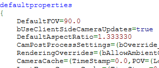

In this guide I want to show people, that are new to this, how I started and what made this whole process a lot easier for me.

# What you will need

[Unreal Package Decompressor](http://www.gildor.org/downloads)

[UE Explorer](http://eliotvu.com/portfolio/view/21/ue-explorer)


# 1: Preparing the Files

Extract the decompressor and install UE Explorer.

Copy the two files below from ***\Borderlands 2\WillowGame\CookedPCConsole*** into the folder where the ***decompress.exe*** is located.

	* Startup.upk
	* Engine.upk

Just drag them onto the ***decompress.exe*** now and you should now have a new folder called ***unpacked*** in there.

These files are the ones you want to open up in UE Explorer.

# Note: Unfortunately UE Explorer won't show you all objects/classes etc. I'll follow up with a few other methods on how to find more stuff.

# 2: Using UE Explorer
### 2.1: Using Startup.upk

Let's open up the decompressed ***Startup.upk***.

On the left side at the top, click now on ***Objects*** and below on ***Content***.

You'll now see a big treeview of all the objects UE Explorer could find. Let's open up
***GD_Itempools*** for example.

Now we can see all the objects that are inside of ***GD_Itempools***.
So let's use ***DropWeights*** for example.

This is the object that contains the ***DropODDS***-Objects. So basically the odds of this object dropping something.


Let's check ***DropODDS_BuffDrinks***. Inside we see two objects. Click on ***ConstantAttributeValueResolver_1*** and on the right side we'll see the property ***ConstantValue*** with a value of ***0.050***.

Now check the ***// Reference:***-line below.

We can copy almost everything from this to directly use it in the game.
***GD_Itempools.DropWeights.DropODDS_BuffDrinks.ConstantAttributeValueResolver_1*** in this case.

So to change the ConstantValue in the game, we can just use this in the console:

```
set GD_Itempools.DropWeights.DropODDS_BuffDrinks.ConstantAttributeValueResolver_1 ConstantValue 0.65
```

### 2.2: Using Engine.upk
#### Note: Also this won't show you everything there is. You'll find a lot more if you use the console in the game to poke around. This should give you a good basic understanding of what to look for, what you can use and where/when.

Using UE Explorer with the Engine.upk is a little bit different but revealed a lot more stuff to me.

Here's a small example.

First we open it up. Once again we choose ***Objects*** at the top-left.
This time, if we click on ***Content*** we barely get anything.

BUT, this time we can click on ***Classes***.

Here, we can also actually use the search-function. This is incredibly useful.
You can either click on ***Tools -> Find -> Find in classes*** or press CTRL+Shift+F. Enter any keyword you're looking for.

For this example I'm just going to open up the class ***Camera*** instead.

On the right side, you'll now see actual code.
The best things can usually be found at the very bottom of the class. It's basically a list of all the ***defaultproperties*** being used by this class.



Let's say we'd like to change the value of ***DefaultFOV***.

Building the command for this is very easy.

Take the ***class name***, the ***propertyname*** and the ***value*** you want, type ***set*** in front of it, and you got your command.

For this example:

```set Camera DefaultFOV 85.0```
