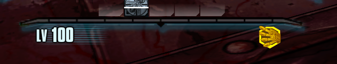
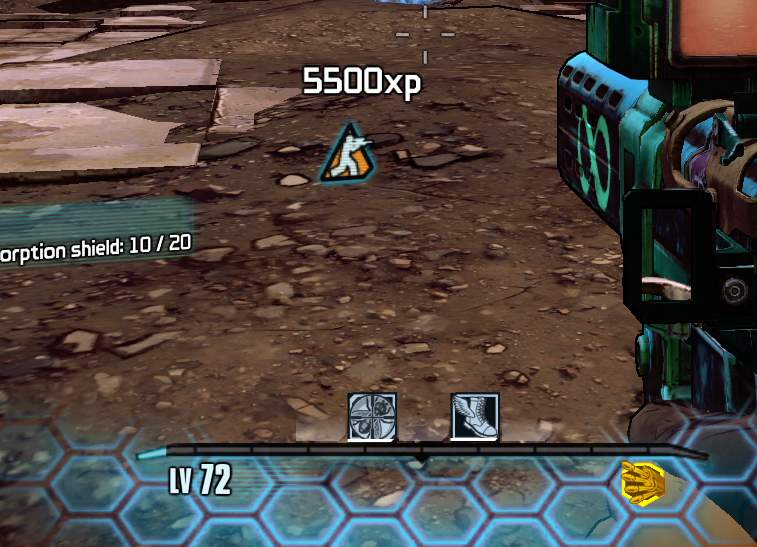
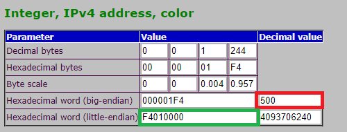

# Hex Multitool on this site is outdated!
Use the Borderlands Hex Multitool from here instead:

https://github.com/c0dycode/Borderlands-Hex-Multitool

# Removing the 100 Element-limit

Usually you'd only get up to 100 elements per Array.
For example:

```
Attributes(89)=None
Attributes(90)=None
Attributes(91)=None
Attributes(92)=None
Attributes(93)=None
Attributes(94)=None
Attributes(95)=None
Attributes(96)=None
Attributes(97)=None
Attributes(98)=None
Attributes(99)=None
... 239 more elements
```

To remove this limit, we need to patch the Borderlands2.exe-file.

To remove the limit itself

Patch (this one also works for TPS):
```
7E 05 B9 64 00 00 00 3B F9 0F 8D
```
to
```
75 05 B9 64 00 00 00 3B F9 0F 8D
```

If you'd also like to remove the message ***... XY more elements***

Patch this aswell:
```
0F 8C 7B 00 00 00 8B 8D 9C EE FF FF 83 C0 9D 50
```
to
```
0F 85 7B 00 00 00 8B 8D 9C EE FF FF 83 C0 9D 50
```


## TPS Specific
To remove the message mentioned above -
patch:
```
7C 7B 8B 8D 94 EE FF FF
```
to
```
75 7B 8B 8D 94 EE FF FF
```


Here are a few things to test it with
```
obj dump GD_AttributePresentation._AttributeList.DefaultPresentationList
obj dump Common_Materials.Creature.Master_CreatureShock
obj dump Common_Materials.Creature.Master_CreatureSlag
obj dump Common_Materials.Environment.Master_Barrel
obj dump Common_Materials.Environment.Master_Rocks
obj dump Common_Materials.Environment.Master_World
obj dump Common_Materials.Environment.Master_WorldMasked
obj dump Common_Materials.Items.Master_ClassMod_02
obj dump Common_Materials.Items.Master_ShieldGrenade
obj dump Common_Materials.Player.Master_Player
obj dump Common_Materials.Weapons.Master_Gun
obj dump FX_WEP_Scopes.Materials.Mat_Scope_Reticle_MS
obj dump GD_AttributePresentation._AttributeList.DefaultPresentationList
obj dump GD_CustomItemPools_MainGame.AllCustomizationsItemPool
```

Thanks to LightChaosman for telling me about this issue :D


# Increasing Backpack-Storage
## Newest and best way
Note: This will allow you to get up to 2147483647 inventoryspace. This will **NOT** be stable. From my testing, the game started to have issues with about 200.000 EMPTY slots. So - as always, use at your own risk.

Find
```
0C 00 00 00 EB 0A 83 F8
```

For ease of understanding, I'll call each pair of values a **block**.

From the found **0C** we move 8 blocks forward. We should then be at **27**.
This is the value of, what I call, the **Spacetrigger**.

This determines if you currently have reached 39 (27 Hex is 39 decimal) Inventoryslots with bought SDUs.

From here on, move 4 blocks forward again. You should be at another **27**.
This will be your actual backpackspace, once you're at the **Spacetrigger** above.

By default, you should have 
```
27 00 00 00
```

To get the value you need to write here, please refer to the steps below at the Eridium-Patch: https://github.com/c0dycode/BL2ModStuff/tree/master/Hexediting#increasing-max-eridium

## Outdated
Find

 ```
 CC CC 8B 81 B8 01 00 00 C3 CC CC CC CC CC CC CC CC CC
 ```

 and replace with 

 ```
 CC CC 8B 81 B8 01 00 00 83 C0 05 C3 CC CC CC CC CC CC
 ```

 Replace the ***05*** with the value you want to increase the backpack-storage with (in HEX).
***The maximum value you can use*** to increase your inventory slots, is ***7F***.
7F = 127

You can either use the Windows Calculator to convert from decimal to hex, or simply go to this site:

http://www.rapidtables.com/convert/number/decimal-to-hex.htm

The value you use instead of the ***05*** is added to that base-value in the game. So with all upgrades you have 39 slots. If you then use the ***05*** you'll now have 44 slots.

Should you encounter the bug where you can't scroll anymore, I could fix it by either reopening the inventory or tabbing out and back into the game.

***Note***: This will extend your inventoryslots by the given number each time you save and reload the game until you reach 39 slots + the given number.

## New method (also Outdated)

To fix the side-effect noted above, here's a method that checks the amount of slots. Once you've reached 39 slots, your backpackspace will increase by the given number.

```
8B 81 B8 01 00 00 83 F8 27 7D 01 C3 83 C0 05 C3
```

If you have done the first version-edit before, you'll need to "overwrite" it.
That means:
```
CC CC 8B 81 B8 01 00 00 83 C0 05 C3 CC CC CC CC CC CC
```

will become

```
CC CC 8B 81 B8 01 00 00 83 F8 27 74 01 C3 83 C0 05 C3
```

Again, replace the ***05*** with the amount of slots you want to get after reaching max slots. This won't make the Backpack-SDUs useless.

Thanks to LightChaosman and MediEvilHero for pointing that out :)

## Bugreports
- Orudeon told me he couldn't pickup anything although he had 14/23 backpackspace, when the Host didn't have the hexedit. This still needs confirmation, more testing though. (This was with the first version of the edit)

# Increasing Max Level

Thanks to Shadow for giving me a few important places that have been found before this patch existed, that eventually lead to me being able to find a working way to patch this!

## Newest Version 07-27-2017
The newest version reduces the max level you can set to 92. That's because OP levels work again.

Also enemies, item-/weapondrops and vendor-items scale now properly.

## Previous Versions
```
Very first testbuild to change max level up to 100.

I'm not responsible for exploding friends or corrupting your/their savegames. ¯\_(ツ)_/¯

Things tested in multiplayer so far:
- People can join you without the patch, and they will level too.
 If and what side-effects this has on their saves, no idea yet.

- If you're above lvl 72, it looks like you can't join people anymore that
 don't have this patch applied. (Constantly sending character infos to the host)
```

## Instructions
```
Put in the Win32-folder where your Borderlands2.exe also is.
***Backup your saves***, JIC.

Backing up the exe should not be necessary, since the tool can ***Undo*** the changes.

Again the Disclaimer:
I'm not responsible for exploding friends or corrupting your/their savegames ¯\_(ツ)_/¯
Or any issues caused by this patch, for that matter.
```


```
Things tested in multiplayer so far:
- People can join you without the patch, and they will level too. If and what side-effects this has to their saves, no idea yet.
- If you're above lvl 72, it looks like you can't join people anymore that don't have this patch applied. (Constantly sending character infos to the host)
```






# Increasing Max Eridium
Find the following Array of bytes:
```
FF E0 F5 05 F4 01 00 00 E7 03 00 00 E7
```

To find the correct value you need to use, I highly recommend you use this site:

https://www.darkfader.net/toolbox/convert/
Scroll down to ***Integer, IPv4 address, color***

The default maximum value is ***500***.
So I'll show you an example with that value.



Enter your preferred number in the upper ***decimal*** box. Marked in red.
This results in the hexadecimal-value ***F4 01 00 00***, marked in green. We need to use the ***little-endian***-format.

That's what we also find in the Array above.
FF E0 F5 05 ***F4 01 00 00*** E7 03 00 00 E7

That is the value you need to replace.

For example:
The decimal value ***750*** results in the hexadecimal-value ***EE 02 00 00***.

So the final patch would be

```
FF E0 F5 05 EE 02 00 00 E7 03 00 00 E7
```

If you want the absolute maximum (2147483647),
you'd have to use ***FF FF FF 7F***. These will not be displayed though. The UI will only show you 999, but you could check with Cheat Engine for example.


# LINUX
Open up the Borderlands2 file with which you open up the game (should be about 36MB in size) in a hexeditor!

## Disable SanityChecks

### Item SanityCheck-Bypass
```
E8 A9 24 17 00
to
90 90 90 90 90
```

### Weapon SanityCheck-Bypass
```
E8 F7 23 17 00
also to
90 90 90 90 90
```

