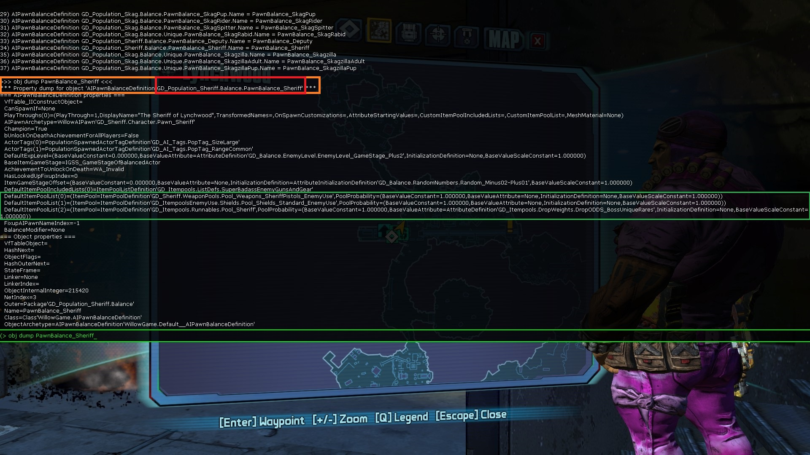

# 1. Find the Lootpool of the specific enemy you want to modify

Move to the area the enemy spawns in and enter this into the console:

```
getall AIPawnBalanceDefinition Name
```

If you don't want to remember the exact command, you can also just create a new file in "Borderlands 2\Binaries\"

Remember, you don't need to give it an extension. So you can just create a new .txt file, edit it, and save it/rename it to just "lootpool" for example.

This way you can just type ***exec lootpool*** instead of ***exec lootpool.txt*** for example.

In this example I'm in Lynchwood at the Travel Station and want to get the "Sheriff"'s Lootpool.
The command results are the follwing:


So we found the "Balance" of the "Sheriff". (marked red)
We only need the green marked part though.

Now we'll ***obj dump*** it.

So in this example:
```
obj dump PawnBalance_Sheriff
```


For ease of access here's the result we need:

```
DefaultItemPoolList(0)=(ItemPool=ItemPoolDefinition'GD_Sheriff.WeaponPools.Pool_Weapons_SheriffPistols_EnemyUse',PoolProbability=(BaseValueConstant=1.000000,BaseValueAttribute=None,InitializationDefinition=None,BaseValueScaleConstant=1.000000))
DefaultItemPoolList(1)=(ItemPool=ItemPoolDefinition'GD_ItempoolsEnemyUse.Shields.Pool_Shields_Standard_EnemyUse',PoolProbability=(BaseValueConstant=1.000000,BaseValueAttribute=None,InitializationDefinition=None,BaseValueScaleConstant=1.000000))
DefaultItemPoolList(2)=(ItemPool=ItemPoolDefinition'GD_Itempools.Runnables.Pool_Sheriff',PoolProbability=(BaseValueConstant=0.000000,BaseValueAttribute=AttributeDefinition'GD_Itempools.DropWeights.DropODDS_BossUniqueRares',InitializationDefinition=None,BaseValueScaleConstant=1.000000))
```

# 2. Modify the Lootpool

Since ***DefaultItemPoolList(2)*** is the only one that is not a guaranteed drop everytime, we're going to up the chance a bit.

The simplest way of modifying the drop chance is:

```
BaseValueConstant x BaseValueScaleConstant = Effective chance for this loot.
```

For the values:

```
1.000000 = 100
```

```
0.900000 = 90
```

```
0.100000 = 10
```

so, it's easy enough :)

Let's say we want a guaranteed drop, so let's change 

```
GD_Itempools.Runnables.Pool_Sheriff',PoolProbability=(BaseValueConstant=0.000000
```

to

```
GD_Itempools.Runnables.Pool_Sheriff',PoolProbability=(BaseValueConstant=1.000000
```

With this method we can only change this if we include all three pools, that were there by default, into the command. AFAIK changing specifics only works with hotfixes.

For step three, we take another look at the result of "obj dump PawnBalance_Sheriff"
The orange marked area shows you the execution of the command and the very first line it printed out for us.
We see the class we need for the command (marked red).



So we start off our command with
***set GD_Population_Sheriff.Balance.PawnBalance_Sheriff***

Since we want to modify one of the DefaultItemPoolList(x), this will be our variable name.
The syntax is:

```
set <class> <variable> <value>
```

(For more information go to https://docs.unrealengine.com/udk/Three/ConsoleCommands.html)

```
set GD_Population_Sheriff.Balance.PawnBalance_Sheriff DefaultItemPoolList
```

We will remove "DefaultItemPoolList(0)=", DefaultItemPoolList(1)= and DefaultItemPoolList(2)= in the command
since we basically recreate the array with the set-command and the command already knows what we want to set at this point with the command.

That leaves us with:

```
(ItemPool=ItemPoolDefinition'GD_Sheriff.WeaponPools.Pool_Weapons_SheriffPistols_EnemyUse',PoolProbability=(BaseValueConstant=1.000000,BaseValueAttribute=None,InitializationDefinition=None,BaseValueScaleConstant=1.000000))
(ItemPool=ItemPoolDefinition'GD_ItempoolsEnemyUse.Shields.Pool_Shields_Standard_EnemyUse',PoolProbability=(BaseValueConstant=1.000000,BaseValueAttribute=None,InitializationDefinition=None,BaseValueScaleConstant=1.000000))
(ItemPool=ItemPoolDefinition'GD_Itempools.Runnables.Pool_Sheriff',PoolProbability=(
BaseValueConstant=1.000000,BaseValueAttribute=AttributeDefinition'GD_Itempools.DropWeights.DropODDS_BossUniqueRares',InitializationDefinition=None,BaseValueScaleConstant=1.000000))
```

Add a single "(" infront and add this to "set GD_Population_Sheriff.Balance.PawnBalance_Sheriff DefaultItemPoolList" - DONE.

This is our final command:

```
set GD_Population_Sheriff.Balance.PawnBalance_Sheriff DefaultItemPoolList ((ItemPool=ItemPoolDefinition'GD_Sheriff.WeaponPools.Pool_Weapons_SheriffPistols_EnemyUse',PoolProbability=(BaseValueConstant=1.000000,BaseValueAttribute=None,InitializationDefinition=None,BaseValueScaleConstant=1.000000)),(ItemPool=ItemPoolDefinition'GD_ItempoolsEnemyUse.Shields.Pool_Shields_Standard_EnemyUse',PoolProbability=(BaseValueConstant=1.000000,BaseValueAttribute=None,InitializationDefinition=None,BaseValueScaleConstant=1.000000)),(ItemPool=ItemPoolDefinition'GD_Itempools.Runnables.Pool_Sheriff',PoolProbability=(BaseValueConstant=1.000000,BaseValueAttribute=AttributeDefinition'GD_Itempools.DropWeights.DropODDS_BossUniqueRares',InitializationDefinition=None,BaseValueScaleConstant=1.000000))
```

Maybe some of you already have noted the ***GD_Itempools.DropWeights.DropODDS_BossUniqueRares***. This also has it's own weight/chance.
We can use 

```
obj dump GD_Itempools.DropWeights.DropODDS_BossUniqueRares
```
and will get the following result:

```
ValueResolverChain(0)=ConstantAttributeValueResolver'GD_Itempools.DropWeights.DropODDS_BossUniqueRares:ConstantAttributeValueResolver_0'
```

We're using this one, since we're looking for the "Constant Value" of this specific pool.

So let's use 
```
obj dump GD_Itempools.DropWeights.DropODDS_BossUniqueRares:ConstantAttributeValueResolver_0
```

The result is:
```
=== ConstantAttributeValueResolver properties ===
ConstantValue=0.330000
```

Since this is a much simpler structure than before (no Array in this case) we can modify this value with a very simple command.

```
set GD_Itempools.DropWeights.DropODDS_BossUniqueRares:ConstantAttributeValueResolver_0 ConstantValue 0.66
```

for example!


# Note:
This will not be a "permanent" patch. Execute it everytime you're at the location and you should be good to go. Exiting and re-entering the game counts as Re-Entering the location. Therefore you'll have to execute it again.

For a "permanent" patch, convert this into a hotfix, with the help of adudney's converter located here:

https://github.com/adudney/BL2_Converter

Since this is specifically in Lynchwood, the best matching hotfix-type would be ***SparkLevelPatchEntry***

(Thanks again the_Nocturni)


# Creating the Hotfix
## Adudney's converter method
### Note: This requires you to have the above mentioned converter compiled and working.
###		  Scroll down for a different method which doesn't require Rust and any compiling.

Okay, let's take our final command again

```
set GD_Population_Sheriff.Balance.PawnBalance_Sheriff DefaultItemPoolList ((ItemPool=ItemPoolDefinition'GD_Sheriff.WeaponPools.Pool_Weapons_SheriffPistols_EnemyUse',PoolProbability=(BaseValueConstant=1.000000,BaseValueAttribute=None,InitializationDefinition=None,BaseValueScaleConstant=1.000000)),(ItemPool=ItemPoolDefinition'GD_ItempoolsEnemyUse.Shields.Pool_Shields_Standard_EnemyUse',PoolProbability=(BaseValueConstant=1.000000,BaseValueAttribute=None,InitializationDefinition=None,BaseValueScaleConstant=1.000000)),(ItemPool=ItemPoolDefinition'GD_Itempools.Runnables.Pool_Sheriff',PoolProbability=(BaseValueConstant=1.000000,BaseValueAttribute=AttributeDefinition'GD_Itempools.DropWeights.DropODDS_BossUniqueRares',InitializationDefinition=None,BaseValueScaleConstant=1.000000))
```

Create a new file where the ***converter.exe*** is located at and call it "sheriff.hotfix". NOT "sheriff.hotfix.txt" :P

Paste the command above in it.

Now move above our command and take a look at the Syntax and Types on the converter-page.
Another good resource for this is the wiki :)

https://github.com/BL2CP/BLCMods/wiki/Tutorial:-Hotfix-Data


If we take a look at the included "base_game.hotfix" we can see what we basically have to do.
For example we see

```
start Level SouthpawFactory_P
set_cmp GD_Population_Marauder.Balance.Unique.PawnBalance_Assassin1 DefaultItemPoolList[3].PoolProbability.BaseValueScaleConstant 0.250000 1
```

Breaking this down we get:

```
start | Level | SouthpawFactory_P

start of this hotfix-part | Level (this patch will be triggered in a specific level/location) | Travelstation Name.
```

To get the TS-Name use this command.

```
getall LevelTravelStationDefinition StationLevelName
```

We can also use

```
getall LevelTravelStationDefinition DisplayName
```
If we just can't find the correct object name, for example:
I was trying to find ***Wildlife Exploitation Preserve*** and just couldn't find it.
This revealed to me, that it's ***GD_LevelTravelStations.Zone2.PandoraParkToCreatureSlaughter***
So I just ***obj dump*** it and look at the result for ***StationLevelName***

```
=== TravelStationDefinition properties ===
StationLevelName=PandoraPark_P
```

And just like in Step1, we choose the value at the end. For this example, this means:

```
Grass_Lynchwood_P
```

It can be a bit of a PITA to find the right one. I don't know any easier way to do it though. Just copy the results out of the console window (if you use the steam "-log" launchparameter), paste it into notepad and use the search-function.

You can test if you got the correct one by typing ***open Grass_Lynchwood_P*** in the game console, for example.


So our first line in the hotfix-file is

```
start Level Grass_Lynchwood_P
```

Now the second line 

```
set_cmp | GD_Population_Marauder.Balance.Unique.PawnBalance_Assassin1 | DefaultItemPoolList[3].PoolProbability.BaseValueScaleConstant | 0.250000 | 1

set_compare | the object where the value is at | "Path" to the final variable we want to "access" | value to check for | value to set it to
```

set_cmp is not really necessary. You can also replace it by ***set***

Syntax then would be

```
set <object> <path> <value>
```


Remember we had to use all three ***DefaultItemPoolList(x)*** entries in our previous command or otherwise we would only keep the one we got in our command?
As you can see in the hotfix-command above, we can now access a specific number in the array. In the case above it's [3].


Since our value we wanted to adjust initially was at DefaultItemPoolList(2) we'll now use 2 here aswell and we do not have to add the other 2 variables before that to keep them.
Remember, accessing the first value would be (0) or in this case [0].

So let's build our final commands for the hotfix-file.

```
start Level Grass_Lynchwood_P
set GD_Population_Sheriff.Balance.PawnBalance_Sheriff DefaultItemPoolList[2].PoolProbability.BaseValueConstant 1.0
```

Save the file and drag it onto the converter.exe.
This will output the hotfix-patch-file into hotfix_output.txt.

Rename and copy this into your Binaries-folder and execute it in the game console.

Travel to Lynchwood and type in ***obj dump PawnBalance_Sheriff*** again.

DONE!

Congratulations, you've created yourself a hotfix-file :)

And to check against it, here's the final hotfix:

```
set Transient.SparkServiceConfiguration_6 Keys ("SparkLevelPatchEntry-sheriff1")

set Transient.SparkServiceConfiguration_6 Values ("Grass_Lynchwood_P,GD_Population_Sheriff.Balance.PawnBalance_Sheriff,DefaultItemPoolList[2].PoolProbability.BaseValueConstant,,1.0")
```

## LightChaosman's UCP FilterTool method
This tool let's you customize the huge UCP-patchfile. Just check and uncheck the mods you want/don't want.
More infos about that can be found in this video by the creator LightChaosman: https://youtu.be/zJ4qI4U_lE0
To always get the most recent version of this tool, head onto shadows discord server and check the #borderlands_mods_to_download channel.

Open up the ***FilterTool.jar*** and click on ***Misc tools -> Convert .hotfix file*** at the top.


Browse to your ***.hotfix-file*** and hit ***Open***.

If everything went correctly, a window will pop up and say
```
Conversion complete
Conversion complete. Output file: ***XY.hotfix.output***
```

Now click ***Developer tools -> Add single mod*** at the top, browse to your above generated output file ***XY.hotfix.output*** and hit ***Open***.


This will import your hotfix into the huge UCP-patchfile. Make sure it's checked, hit CTRL+S to save and you're ready to go and execute it in the main menu. :)

SHOULD you get any errors after executing the patch-file in the main menu, make sure to wait a few more seconds and try again. Some data may not have been loaded at that point.


# Creds :P


If there are any mistakes feel free to hit me up on shadow's discord (c0dycode) :)

Thanks to Shadows Patch and Discord-Community.

Especially the_Nocturni for explaining a lot of things, also Mike and EarthAries who started that conversation where I could get most of the infos from :P
Also Adudney and LightChaosman for their awesome tools :)