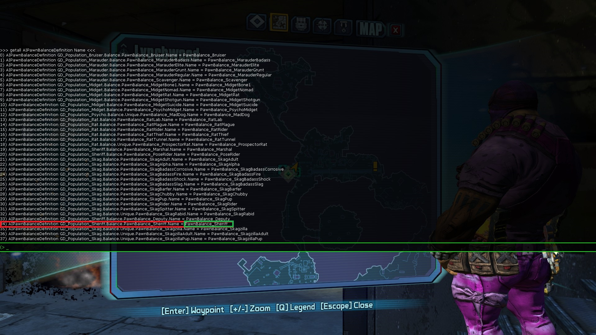

1.Find the Lootpool of the specific enemy you want to modify.

Move to the area the enemy spawns in and enter this into the console:
getall AIPawnBalanceDefinition Name

In this example I'm in Lynchwood at the Travel Station and want to get the "Sheriff"'s Lootpool.
The command results are the follwing:

So we found the "Balance" of the "Sheriff". (marked red)
We only need the green marked part though.

Now we'll "obj dump" it.

So in this example:
"obj dump PawnBalance_Sheriff"

For ease of access here's the result we need:

DefaultItemPoolList(0)=(ItemPool=ItemPoolDefinition'GD_Sheriff.WeaponPools.Pool_Weapons_SheriffPistols_EnemyUse',PoolProbability=(BaseValueConstant=1.000000,BaseValueAttribute=None,InitializationDefinition=None,BaseValueScaleConstant=1.000000))
DefaultItemPoolList(1)=(ItemPool=ItemPoolDefinition'GD_ItempoolsEnemyUse.Shields.Pool_Shields_Standard_EnemyUse',PoolProbability=(BaseValueConstant=1.000000,BaseValueAttribute=None,InitializationDefinition=None,BaseValueScaleConstant=1.000000))
DefaultItemPoolList(2)=(ItemPool=ItemPoolDefinition'GD_Itempools.Runnables.Pool_Sheriff',PoolProbability=(BaseValueConstant=0.000000,BaseValueAttribute=AttributeDefinition'GD_Itempools.DropWeights.DropODDS_BossUniqueRares',InitializationDefinition=None,BaseValueScaleConstant=1.000000))

Since "DefaultItemPoolList(2)" is the only one that is not a guaranteed drop everytime, we're going to up the chance a bit.

The simplest way of modifying the drop chance is:
BaseValueConstant*BaseValueScaleConstant=Effective chance for this loot.

Let's say we want a guaranteed drop, so let's change 
"GD_Itempools.Runnables.Pool_Sheriff',PoolProbability=(BaseValueConstant=0.000000"
to
"GD_Itempools.Runnables.Pool_Sheriff',PoolProbability=(BaseValueConstant=1.000000"

With this method we can only change this if we include all three pools into the command. AFAIK changing specifics only works with hotfixes.

For step three, we take another look at the result of "obj dump PawnBalance_Sheriff"
The orange marked area shows you the execution of the command and the very first line it printed out for us.
We see the class we need for the command (marked red).

So we start off our command with
"set GD_Population_Sheriff.Balance.PawnBalance_Sheriff"

Since we want to modify one of the "DefaultItemPoolList(x)", this will be our variable name.
The syntax is:
set <class> <variable> <value>

(For more information goto the unrealengine link below)

"set GD_Population_Sheriff.Balance.PawnBalance_Sheriff DefaultItemPoolList"

We will remove "DefaultItemPoolList(0)=", DefaultItemPoolList(1)= and DefaultItemPoolList(2)= in the command
since we basically recreate the array with the set-command and the command already knows what we want to set at this point with the command.

That leaves us with:

(ItemPool=ItemPoolDefinition'GD_Sheriff.WeaponPools.Pool_Weapons_SheriffPistols_EnemyUse',PoolProbability=(BaseValueConstant=1.000000,BaseValueAttribute=None,InitializationDefinition=None,BaseValueScaleConstant=1.000000))
(ItemPool=ItemPoolDefinition'GD_ItempoolsEnemyUse.Shields.Pool_Shields_Standard_EnemyUse',PoolProbability=(BaseValueConstant=1.000000,BaseValueAttribute=None,InitializationDefinition=None,BaseValueScaleConstant=1.000000))
(ItemPool=ItemPoolDefinition'GD_Itempools.Runnables.Pool_Sheriff',PoolProbability=(
BaseValueConstant=0.000000,BaseValueAttribute=AttributeDefinition'GD_Itempools.DropWeights.DropODDS_BossUniqueRares',InitializationDefinition=None,BaseValueScaleConstant=1.000000))

Add a single "(" infront and add this to "set GD_Population_Sheriff.Balance.PawnBalance_Sheriff DefaultItemPoolList" - DONE.

https://docs.unrealengine.com/udk/Three/ConsoleCommands.html

If there are any mistakes feel free to hit me up on shadow's discord (c0dycode) :)

Thanks to Shadow's Patch and Discord-Community
Especially the_Nocturni who explained it, also Mike and EarthAries who started that conversation where I could get most of the infos from :P
