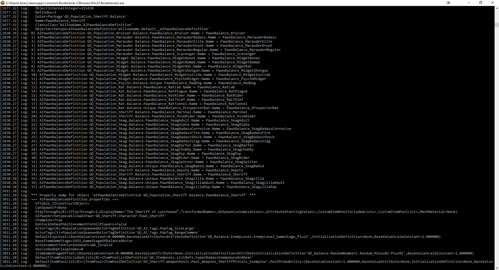

# BL2ModStuff

For me, it's easier to set the launchoption "-log" in Steam. 
This will open up a seperate window each time you launch BL2 where you get the same output as in the console in the game.
Makes it a lot easier for me to copy results without navigating to the log-file.

Example here:

